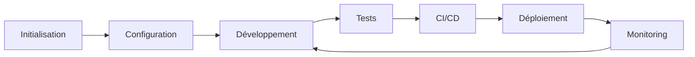

# 🎨 Documentation Projet Next.js Full-Stack

**Kit de démarrage pour créer des projets Next.js modernes avec IA**

---

## 📋 Vue d'ensemble

Cette documentation fournit une méthodologie complète pour créer des projets full-stack modernes utilisant :

- **Frontend/Backend** : Next.js 15+ avec App Router
- **Base de données** : PostgreSQL avec Prisma ORM
- **Authentification** : NextAuth.js v5
- **Déploiement** : Vercel
- **Versionning** : Git + GitHub
- **Agent IA** : Claude Code/ Codex / Grok

## 🎯 Objectifs

- Lancer un nouveau projet en **moins d'1h**
- Appliquer les **meilleures pratiques** dès le départ
- Assurer la **qualité** et la **sécurité** du code
- Faciliter le **déploiement** et la **maintenance**
- Optimiser les **performances** et le **SEO**

## 🗂️ Structure de la documentation

### 🚀 [quickstart/](quickstart/)
Guide de démarrage rapide pour setup initial (<1h)

### 🏗️ [architecture/](architecture/)
Principes d'architecture, stack technique, patterns

### ⚙️ [configuration/](configuration/)
Configuration des outils (Next.js, Prisma, Vercel, etc.)

### 📏 [regles-strictes/](regles-strictes/)
Règles non-négociables du projet

### 💡 [recommandations/](recommandations/)
Bonnes pratiques recommandées

### 🤖 [integration-ia/](integration-ia/)
Intégration de l'agent IA dans le workflow

### 🧪 [tests/](tests/)
Stratégie et mise en place des tests

### 🔄 [workflows/](workflows/)
CI/CD, GitHub Actions, hooks Git

### 🔐 [securite/](securite/)
Sécurité, authentification, protection des données

### 🔧 [maintenance/](maintenance/)
Monitoring, debugging, mise à jour

## 🚀 Démarrage rapide

### Prérequis

- Node.js 20+
- pnpm (gestionnaire de packages)
- Git
- Compte GitHub
- Compte Vercel
- Base de données PostgreSQL (ex: Supabase)

### Installation en 3 étapes

```bash
# 1. Cloner le template
git clone <votre-template-repo>
cd mon-projet

# 2. Installer les dépendances
pnpm install

# 3. Configurer l'environnement
cp .env.example .env.local
# Éditer .env.local avec vos variables
```

### Checklist initiale

- [ ] Node.js 20+ installé
- [ ] pnpm installé globalement
- [ ] Git configuré (user.name, user.email)
- [ ] Compte GitHub créé
- [ ] Compte Vercel lié à GitHub
- [ ] Base de données PostgreSQL créée
- [ ] Variables d'environnement configurées

## 📚 Philosophie du projet

### Principes fondamentaux

1. **TypeScript strict** : Type safety à 100%
2. **Performance first** : Core Web Vitals optimisés
3. **Sécurité by design** : Headers, CSP, validation
4. **SEO-friendly** : Metadata, sitemap, structured data
5. **Mobile-first** : Responsive et Progressive Web App
6. **Developer Experience** : Outils de qualité (ESLint, Prettier, Husky)

### Stack technique

| Composant | Technologie | Version |
|-----------|-------------|---------|
| Framework | Next.js | 15+ |
| Runtime | React | 19+ |
| Language | TypeScript | 5.7+ |
| Styling | CSS Modules | - |
| Database | PostgreSQL | - |
| ORM | Prisma | 6+ |
| Auth | NextAuth.js | 5.0 |
| State | Zustand | 5+ |
| Data Fetching | TanStack Query | 5+ |
| Deployment | Vercel | - |
| Package Manager | pnpm | - |

## 🎓 Pour qui ?

Cette documentation est destinée à :

- **Développeurs** souhaitant démarrer un nouveau projet Next.js
- **Équipes** voulant standardiser leur méthodologie
- **Agents IA** (Claude Code) pour automatiser le setup
- **Étudiants** apprenant le développement full-stack moderne

## 🔄 Workflow typique



1. **Initialisation** : Setup environnement et dépendances
2. **Configuration** : Database, auth, API, services externes
3. **Développement** : Features avec best practices
4. **Tests** : Unitaires, intégration, E2E
5. **CI/CD** : Validation automatique (lint, type-check, tests)
6. **Déploiement** : Preview + Production sur Vercel
7. **Monitoring** : Analytics, errors, performance

## 📖 Comment utiliser cette documentation

### Pour un humain

1. Lire [quickstart/00-checklist-demarrage.md](quickstart/00-checklist-demarrage.md)
2. Suivre étape par étape les guides de setup
3. Se référer aux règles strictes pendant le développement
4. Consulter les recommandations pour optimiser

### Pour un agent IA

1. Charger cette documentation dans le contexte
2. Exécuter [quickstart/00-checklist-demarrage.md](quickstart/00-checklist-demarrage.md)
3. Valider chaque étape avec les critères définis
4. Appliquer systématiquement les règles strictes
5. Créer des issues GitHub pour les warnings/erreurs

## 🆘 Support

- **Documentation Next.js** : https://nextjs.org/docs
- **Documentation Prisma** : https://www.prisma.io/docs
- **Documentation NextAuth** : https://authjs.dev
- **Stack Overflow** : Tag `next.js`, `prisma`, `nextauth`

## 📄 Licence

Cette documentation est basée sur le projet **Art Factory** (Nouvelle-Calédonie)
Adaptée pour servir de template universel pour projets Next.js

---

**🚀 Prêt à démarrer ? Consultez [quickstart/00-checklist-demarrage.md](quickstart/00-checklist-demarrage.md)**
